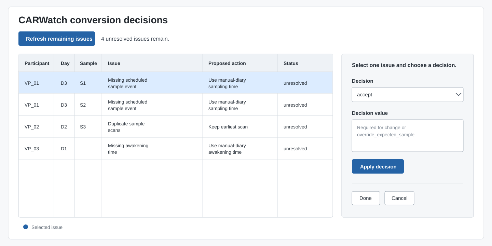
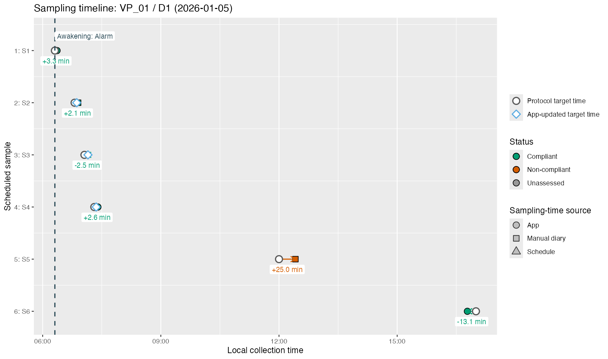
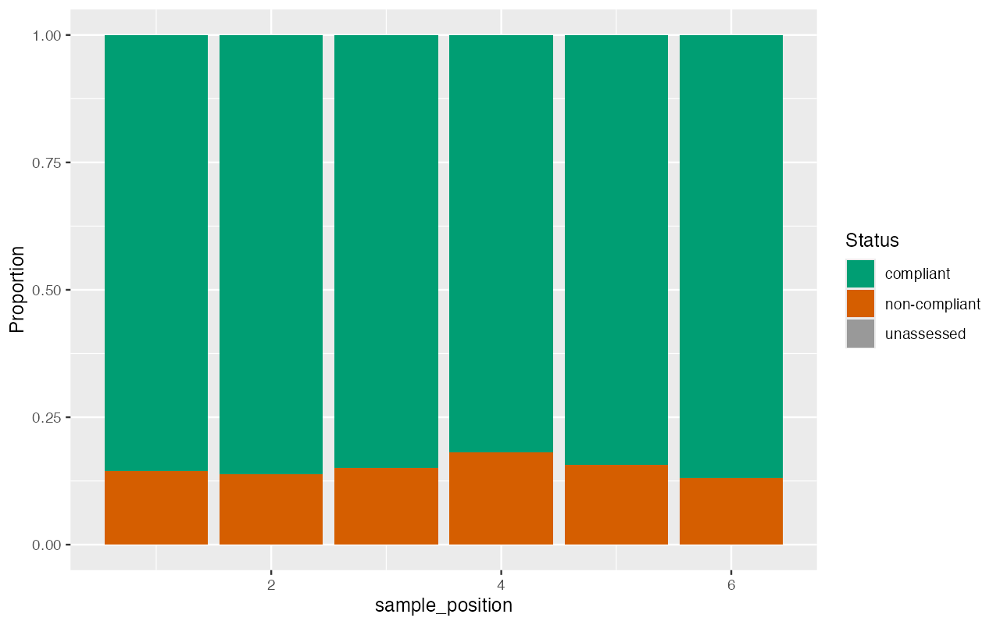
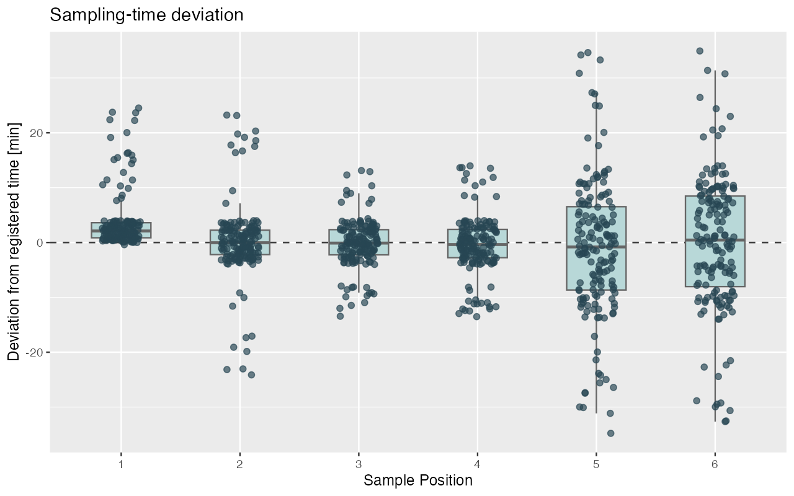
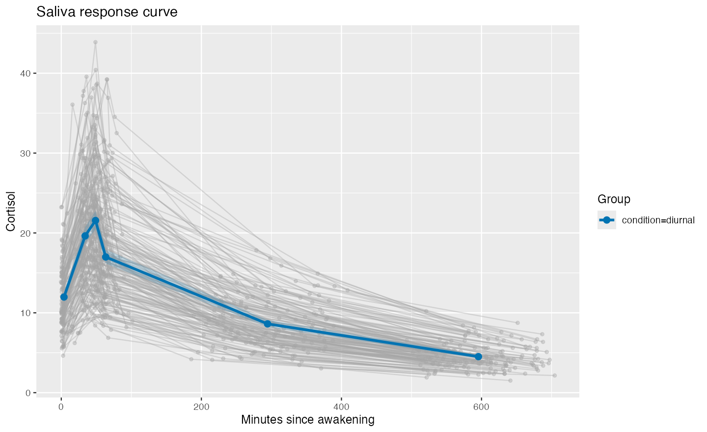

# `carwatch` for R - Tools for processing CARWatch and saliva data

This R package supports the processing of sampling logs recorded by _CARWatch_ and their
integration with laboratory biomarkers. It is designed for ambulatory sampling
studies in which researchers need auditable sampling times, protocol deviations,
manual diary fallbacks, and biomarker features.

The package reads the app log exports, reconstructs each study day, compares planned and recorded sample times, lets you review unclear records, and combines the result with laboratory data, such as cortisol. The original app exports are never changed. The package creates a separate table of questions and decisions when information is missing or inconsistent. This makes it possible to rerun the same analysis later and understand how each decision was made.

The features include:
- Import CARWatch logs from CSV files, ZIP archives, and participant folders
- Reconstruct expected study days, sampling positions, and timing compliance
- Create and reload a review table for conversion issues
- Review conversion anomalies in a structured, editable two-pass issue report
- Patch missing timestamps from manual measurement diary
- Read and write complete Study Results CSV files
- Merge laboratory saliva measurements by physical sample ID or scheduled sample position
- Correct documented tube swaps
- Compute cortisol response features and static quality-control plots

The [examples directory](examples/) contains four end-to-end R Markdown
walkthroughs and nine focused gallery workflows. Start with
[the tutorial guide](https://carwatch-tools.github.io/carwatch-r/articles/tutorials.html)
to choose and run a tutorial; the [published examples catalogue](https://carwatch-tools.github.io/carwatch-r/articles/examples.html)
lists the complete set.
The [package website](https://carwatch-tools.github.io/carwatch-r) provides the
installed-package tutorials and a searchable reference for every public
function.

## Installation

CARWatch requires R 4.3 or newer and is easiest to use in RStudio.

1. Install [R](https://cran.r-project.org/).
2. Install [RStudio Desktop](https://docs.posit.co/ide/user/#rstudio-ide-oss-downloads).
3. Start RStudio. RStudio is the application you use to write and run R code;
   it needs R to be installed first.

On macOS, R can alternatively be installed with Homebrew:

~~~sh
brew install r
~~~

Install CARWatch from GitHub in the RStudio Console:

~~~r
install.packages("remotes")
remotes::install_github("carwatch-tools/carwatch-r")
library(carwatch)
~~~

Install these packages only if you want to run the R Markdown tutorials or the
interactive apps:

~~~r
install.packages(c("pkgload", "rmarkdown", "shiny", "DT"))
~~~

To run the supplied tutorials, download or clone this repository, open
`examples/examples.Rproj` in RStudio, and open an `.Rmd` file in the
`examples` folder. Use **Run All** to execute it step by step, or **Knit** to
create an HTML report. The [tutorial guide](https://carwatch-tools.github.io/carwatch-r/articles/tutorials.html)
explains which file to start with. The tutorials load the code from this
checkout, so after a package-code change you can rerun the setup chunk; you do
not need to reinstall the package for every edit.

## Typical workflow

### Workflow at a glance

CARWatch keeps data import, researcher decisions, and analysis as separate
steps:

~~~text
CARWatch app exports
        |
        v
Import logs and check which files were used
        |
        v
First conversion: reconstruct the study and create a review report
        |
        v
Review the reported issues and record your decisions
        |
        v
Final conversion: create complete Study Results
        |
        +----> inspect timing and compliance
        +----> save and reload the processed study
        +----> merge laboratory data and compute saliva features (e.g., AUC, max increase, slope)
~~~

The two conversion passes are intentional. The first pass shows how CARWatch
understands the app logs and identifies records that need review. The second
pass applies the submitted decisions to the original logs. The app exports
remain unchanged throughout.

### Basic concepts

| Term | Meaning |
| --- | --- |
| **Raw logs** (`raw_logs`) | The events exported by the CARWatch app, such as saved study settings, awakening events, and barcode scans. These are the original input data. |
| **File-import log** (`source_audit`) | A table showing which CSV or ZIP files were used or skipped and why. |
| **Registration** | A set of study settings saved in the app for a participant: study name, number of days, sample IDs in their planned order, and sampling times. Saving a changed setup creates another registration. |
| **Protocol** | The intended order of registrations, study days, and samples across the whole study. CARWatch normally reconstructs it from the registrations found in the app logs. |
| **Protocol manifest** (`protocol_manifest`) | An optional R list in which you state the intended protocol order explicitly. Most studies do not need one. It is useful when the available app logs do not establish one unambiguous order. |
| **Conversion report** | The review table produced by the first conversion. It describes missing or inconsistent information and contains suggested decisions. Suggestions are not applied automatically. |
| **Manual diary** | A table of awakening and sampling times that were written down outside the app (e.g., on paper). This can be used as fallback information when the app logs are incomplete. It is used only when a decision explicitly sets the source of an awakening or sampling time to "manual diary" because the app logs are missing or inconsistent. The manual diary is not used automatically. |
| **Scheduled sample** | The tube expected at a particular position according to the registration. |
| **Recorded sample** | The tube actually scanned in the app. It may differ from the scheduled tube, for example after a tube swap. |
| **Sample position** | The first, second, third, and so on sampling position defined by the order saved in the registration. CARWatch does not derive this from the spelling of a tube ID or file name. |
| **Study Results** (`study_results`) | The final processed study data. They contain study days, planned and recorded sampling times, compliance, information about where each time came from, and later any merged laboratory values. |

### Detailed workflow

#### 1. Load raw CARWatch logs

For one folder per participant, provide the participant IDs explicitly. Folders
can contain nested CSV exports and ZIP archives.

~~~r
participant_dirs <- c(
  vp01 = "data/carwatch/vp01",
  vp02 = "data/carwatch/vp02"
)
imported <- read_raw_logs_from_participant_dirs(
  participant_dirs,
  create_report = TRUE
)
raw_logs <- imported$raw_logs
source_audit <- imported$source_audit
~~~

`source_audit` is a log of which files CARWatch used or skipped and why. It is
useful when checking that all participant exports were included. When the exact
sources are already known:

~~~r
raw_logs <- read_raw_logs(c(
  "data/carwatch/vp01.csv",
  "data/carwatch/vp02.zip"
))
~~~

#### 2. Create a first review report

The first conversion creates a provisional result and a list of records that
need review. It also calculates planned sample times and timing compliance.

~~~r
initial <- convert_raw_logs(
  raw_logs,
  errors = "warn",
  create_report = TRUE
)
initial$report$summary
write_conversion_report(initial$report, "conversion_issues.csv")
~~~

The suggested decisions are only recommendations. Nothing is changed until you
submit the edited report in the second conversion.

##### If CARWatch cannot determine the protocol order

For an overview of the reconstructed study schedule, use:

~~~r
summarize_protocol(raw_logs)
extract_registration_schedule(raw_logs)
~~~

If participants were registered in conflicting orders, `carwatch` flags this in
the first report instead of guessing the intended schedule.

Most studies do not need a `protocol_manifest`: leave it at its default value
of `NULL` and let CARWatch reconstruct the protocol from the app logs. Create a
manifest only when the intended order cannot be determined reliably, for
example when:

- participants completed the same registrations in conflicting orders;
- one registration is absent from the available logs; or
- only an incomplete participant record is available.

If CARWatch reconstructs the expected protocol order without such a problem,
do not create a manifest merely for completeness.

A manifest is not a list of participants or input files. It is an ordered list
of the registration setups that make up the study. Each entry describes one
setup exactly as it was configured in the app:

~~~r
protocol_manifest <- list(
  list(
    study_name = "Control",
    study_days = 2L,
    saliva_ids = c("control-1", "control-2", "control-3", "control-4"),
    saliva_times = c(0, 30, 15, 15),
    saliva_absolute_times = character()
  ),
  list(
    study_name = "Challenge",
    study_days = 2L,
    saliva_ids = c("challenge-1", "challenge-2", "challenge-3", "challenge-4"),
    saliva_times = c(0, 30, 15, 15),
    saliva_absolute_times = character()
  )
)

initial <- convert_raw_logs(
  raw_logs,
  protocol_manifest = protocol_manifest,
  errors = "warn",
  create_report = TRUE
)
~~~

The order of the list defines the intended registration order. `study_days`
defines how many study days belong to that registration. `saliva_ids` gives the
planned tube order. `saliva_times` gives the relative timing intervals in
minutes: the first value is relative to awakening and later values are relative
to the preceding sample. Any fixed clock times are placed in
`saliva_absolute_times`.

Every registration setup observed in the logs must also appear in the manifest
with the same study name, number of days, sample order, and timing settings. If
they differ, CARWatch stops instead of silently matching the wrong setup. When
using a manifest, pass the same object to the first and final conversion and to
the interactive decision editor. A complete worked example is available in
[`01-reconstruct-multi-registration-protocol.Rmd`](examples/gallery/02-protocol-variants/01-reconstruct-multi-registration-protocol.Rmd).

#### 3. Review and apply decisions

You can resolve the reported issues either in a spreadsheet or in the
interactive CARWatch decision editor. Both approaches produce the `decisions`
table used by the final conversion.

Load the manual diary when report decisions use it as a fallback. Omit this
line and the `manual_diary` arguments below when the study has no accepted
manual-diary decisions.

~~~r
manual_diary <- read_manual_diary("manual_diary.csv")
~~~

**Option A: edit the report in a spreadsheet.** Open the CSV, choose a decision
for each listed issue, and save it without changing the identifying columns.
Then reload it:

~~~r
decisions <- read_conversion_report("conversion_issues.csv")
~~~

**Option B: resolve the issues interactively.** This requires the optional
`shiny` and `DT` packages:

The figure shows the editor layout; the rows and values are illustrative.

~~~r
decisions <- conversion_report_editor(
  initial$report,
  raw_logs = raw_logs,
  manual_diary = manual_diary
)

write_conversion_report(decisions, "conversion_issues.csv")
~~~

The editor displays the issue table on the left and the available decisions on
the right. Select rows with the mouse or arrow keys, choose a decision, and
press **Apply decision**. Then press **Refresh remaining issues** to rerun the
conversion with all decisions made so far and show only the issues that still
need attention. If a diary-backed decision cannot be applied, that issue is
reset to **Leave unresolved** and remains visible while successfully applied
decisions are hidden. Press **Done** when the review is complete; the editor
then returns the full `decisions` table. Saving that table is recommended so
the review can be reproduced later.

The editor offers only decisions that are valid for the selected issue:

| Decision | Effect | Decision value |
| --- | --- | --- |
| `accept` | Apply the suggested action shown in `proposed_action`. Read its description before accepting because the effect depends on the issue. | Not required. |
| `keep` | Mark the issue as reviewed without applying the suggested correction. The current reconstruction, including any missing value, is retained. | Not required. |
| `drop_sample` | For an issue tied to a sample, clear that sample from the participant's Study Results while retaining the planned sample position. | Not required. |
| `drop_day` | For an issue tied to a study day, clear the complete participant-day from Study Results. | Not required. |
| `drop_participant` | Remove the participant associated with the issue from Study Results. | Not required. |
| `override_expected_sample` | Assign a scan whose expected sample cannot be resolved to another sample in the active registration. This option appears only for the corresponding issue type. | The exact registered sample ID to use. |
| `change` | Apply an alternative, issue-specific correction instead of the proposed action. This option appears only when the issue supports it. | Required; the allowed value depends on the issue, as shown below. |

When `change` is available, `user_decision_value` supports these values:

| Issue | Allowed value for `change` |
| --- | --- |
| Multiple collection dates | `use_earliest_collection_date`, `use_latest_collection_date`, or a complete JSON mapping such as `{"2026-01-05":"D1","2026-01-06":"D2"}`. |
| Possible re-registration | A JSON target such as `{"registration":2}` or `{"registration":"Challenge"}`. |
| Sampling times are not increasing | `sort_samples_by_time`. |
| Missing awakening time | `use_manual_diary_awakening_time`, or an explicit local timestamp such as `2026-01-05 07:10`. |
| Missing scheduled sample | `use_manual_diary_sampling_time` or `use_default`. The latter reconstructs the time from the registered schedule or the supplied `sampling_schedule`. |

If you use a `protocol_manifest`, `sampling_schedule`, or `manual_diary`, pass
the same object to `conversion_report_editor()` so that refreshing the issue
list uses the same settings as the final conversion.

After either review method, run the final conversion:

~~~r
final <- convert_raw_logs(
  raw_logs,
  errors = "raise",
  create_report = TRUE,
  issue_decisions = decisions,
  manual_diary = manual_diary
)
study_results <- final$results
~~~

The final conversion checks that the submitted decisions still apply to the
current data. It prevents an old decision file from being applied to a changed
set of app exports. If you supplied a `protocol_manifest` during the first
conversion, pass the same manifest here as well.

#### 4. Inspect and save complete Study Results

`study_results` contains the complete information needed for later merging,
analysis, and plotting. Use the helper functions below to view it as a table of
study days or a table of individual samples.

~~~r
study_days <- as_study_days(study_results)
sample_events <- as_sample_events(study_results)
write_study_results(study_results, "study_results.csv")

analysis_results <- drop_non_compliant_samples(study_results)
summarize_compliance(study_results)
find_non_compliant_samples(study_results)
~~~

The study-day table includes collection dates, awakening information, and day
compliance. The sample table includes planned and recorded times, sample
positions, tube IDs, timing deviations, and sample compliance.

#### 5. Restore results or import a Study Manager export

~~~r
study_results <- read_study_results("study_results.csv")
display_results <- read_study_results("study_results.csv", simple = TRUE)
study_results <- read_study_manager_export("study_manager_export.csv")
~~~

Use `simple = TRUE` only when you need a compact table to inspect or share.
Keep the default form for merging, analysis, or plotting.

#### 6. Load laboratory saliva data

For physical-ID matching, use a long CSV with participant, sample, and one
biomarker column:

~~~csv
participant,sample,cortisol
vp01,tube-a,8.2
vp01,tube-b,12.6
~~~

~~~r
saliva <- read_saliva("cortisol.csv", saliva_type = "cortisol")
~~~

For position-based laboratory data:

~~~r
saliva_by_position <- data.frame(
  participant = c("vp01", "vp01"),
  day = c("D1", "D1"),
  sample_position = c(1L, 2L),
  cortisol = c(8.2, 12.6)
)
~~~

#### 7. Merge sampling and laboratory data

Recorded physical IDs correct documented swaps by default. Set correct_swaps to
FALSE to match scheduled IDs instead.

~~~r
merged_results <- merge_saliva(
  study_results,
  saliva,
  match_on = "sample",
  correct_swaps = TRUE
)

merged_results <- merge_saliva(
  study_results,
  saliva_by_position,
  match_on = "position"
)
~~~

Extra laboratory columns can be retained as study information. Use
`metadata_cols` to identify them explicitly when CARWatch cannot tell whether a
numeric column is a measurement or a label. Information that is the same for
every sample on one day is stored with the day; information that differs between
tubes stays with the individual sample.

~~~r
merged_results <- merge_saliva(
  study_results,
  saliva_by_position,
  match_on = "position",
  metadata_cols = "condition"
)
~~~

The result remains complete and records whether a laboratory value was found,
which tube was used, and whether a documented swap was corrected.

#### 8. Compute features and quality-control plots

The CARWatch feature adapter groups by participant and day, orders samples by
sample_position, and uses actual sampling times.

~~~r
cortisol_features <- compute_features_from_carwatch(
  merged_results,
  saliva_type = "cortisol"
)
~~~

The sampling timeline compares protocol targets, app-updated targets, and
recorded collection times for one participant-day. Arrows show the signed
timing deviation; color indicates compliance and marker shape identifies the
source of the recorded time.

~~~r
plot_sampling_timeline(study_results, participant = "vp01", day = "D1")
~~~

The compliance overview summarizes compliant, non-compliant, and unassessed
samples at each sampling position.

~~~r
plot_compliance_overview(study_results)
~~~

The deviation plot shows how early or late samples were collected at each
sampling position. Individual points are retained behind the boxplots.

~~~r
plot_timing_deviation(study_results)
~~~

The saliva curve retains the individual participant-day trajectories and adds
the mean response with its confidence interval.

~~~r
plot_saliva_curve(
  merged_results,
  value = "cortisol",
  group_by = "condition"
)
~~~

These figures are generated from deterministic synthetic data with:

~~~sh
Rscript tools/generate_readme_figures.R
~~~

The R and Python figure generators use the same study configuration, 40
participants, anomaly ratios, random seed, bootstrap settings, figure sizes,
and resolution.

For generic long-format saliva data, use `compute_features()`, `auc()`,
`max_value()`, `initial_value()`, `max_increase()`, or `slope()`.

### Optional interactive review

Launch a participant/day selector around the same static timeline used in
reports:

~~~r
interactive_sampling_timeline(study_results)
~~~

Use `launch = FALSE` only when embedding an app or working on the package.

### Synthetic data

Generate deterministic local example data:

~~~r
path <- generate_synthetic_study_data(
  "carwatch-example",
  n_participants = 4,
  random_state = 42,
  non_compliant_sample_ratio = 0.10,
  missing_awakening_time_ratio = 0.01,
  missing_sampling_time_ratio = 0.02,
  create_cortisol_data = TRUE
)
~~~

The generated directory contains raw logs, `manual_diary.csv`, a ready-to-submit
`issue_decisions.csv`, and—when requested—position-indexed `cortisol.csv`.
The example data are useful for learning the workflow without changing real
study files.

## For developers

Package checks, example rendering, and continuous integration are documented
in [Development](docs/development.md).

## Contributing

Bug reports, feature requests, and reproducible examples belong in the
[GitHub issue tracker](https://github.com/carwatch-tools/carwatch-r/issues).
Changes should include tests and documentation for the affected research
workflow.

## Citation

Report the package version used in an analysis. For research using CARWatch,
cite:

> Richer, R., Abel, L., Küderle, A., Eskofier, B. M., & Rohleder, N. (2023).
> CARWatch — A smartphone application for improving the accuracy of cortisol
> awakening response sampling. *Psychoneuroendocrinology, 151*, 106073.
> https://doi.org/10.1016/j.psyneuen.2023.106073

The installed package version is available as:

~~~r
packageVersion("carwatch")
~~~

## License

CARWatch for R is available under the [MIT License](LICENSE.md).
